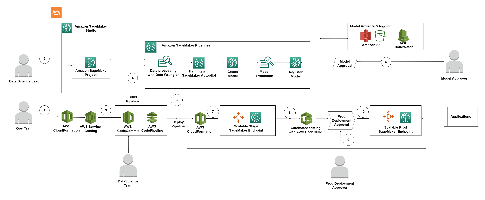

# Amazon SageMaker Project for training your model using SageMaker Autopilot.

This section of the repository contains steps to set up Amazon SageMaker Project for training your ML model using SageMaker Autopilot.

[A SageMaker Project](https://docs.aws.amazon.com/sagemaker/latest/dg/sagemaker-projects-whatis.html) helps organizations set up and standarize environments for automating different steps involved in a Machine Learning Lifecycle.

While notebooks are helpful for model building and experimentation, a team of data scientists and ML engineers sharing code needs a more scalable way to maintain code consistency and strict version control.

Amazon SageMaker provides a set of first-party templates for organizations that want to quickly get started with ML workflows and CI/CD. The templates include projects that use AWS-native services for CI/CD, such as AWS CodeBuild, AWS CodePipeline etc. For more information about SageMaker-Provided Templates refer to this [link](https://docs.aws.amazon.com/sagemaker/latest/dg/sagemaker-projects-templates-sm.html).

SageMaker Projects can support custom template offerings where organizations use a minimum AWS CloudFormation template to execute a Terraform stack and create the resources needed for an ML workflow.

In this section of this repository we will take a look how we can set up an Amazon SageMaker Project to automate and standardize the training of a ML model using SageMaker Autopilot. We will also be using SageMaker DataWrangler to perform preprocessing of the Dataset before submitting to the Autopilot.

## Architecture Diagram

 

### Architecture Overview:

MLOps is a practice that requires different personas working together against a Standardized process using automation tools.

Here are the steps involved in the workflow of this Architecture:

1. Ops team or the Platform team will launch a Cloudformation to set up the prerequisities required to provision the Custom SageMaker Template.
2. Once the template is available in Amazon SageMaker, Data Science Lead will then use that to create a SageMaker project.
3. The SageMaker project creation will kick off a Service Catalog product that will provision the ML pipelines in SageMaker involving SageMaker. It will add a seed code of [UCI Machine Learning Adult Data Set](https://archive.ics.uci.edu/ml/datasets/adult) to CodeCommit Repository. And the CI/CD pipeline will then kicked off using AWS Code Pipeline.
4. The CI/CD pipeline will run a SageMaker Pipeline, which is a series of interconnected steps encoded using a directed acyclic graph (DAG). In this case, the steps involved are Data Processing using Data Wrangler flow, Training model using Autopilot, Creating the model, Evaluating the model & if the evaluation is passed, registering the model. 
5. Once the model is registered, Model approver can either approve or reject the model in SageMaker studio.
6. Once the model is approved, a CodePipeline Deployment pipeline is triggered.
7. This pipeline will create a SageMaker serverless scalable endpoint for Staging environment.
8. There is an automated test step in the deploy pipeline that will be tested on staging endpoint.
9. The test results are stored in S3. The pipeline will stop for a Prod Deployment approver who can review all the artifacts before approving.
10. Once approved, model is deployed to production in the form of scalable serverless endpoint. Prod applications can now consume the endpoint for inference.

### Repository Overview:
* This repository contains the following:

    * [CloudFormation template](autopilot-mlops-product.yaml) to set up the custom SageMaker project template for Autopilot.
            
    * [Seed Code](seedcode) having the ML code to set up SageMaker Pipelines to automate the Data processing & training steps.

    * [Project Folder](project) having the CFN template using by the Service Catalog mapped to the Custom SageMaker project template that will be created.

## Instructions
    
### To be updated